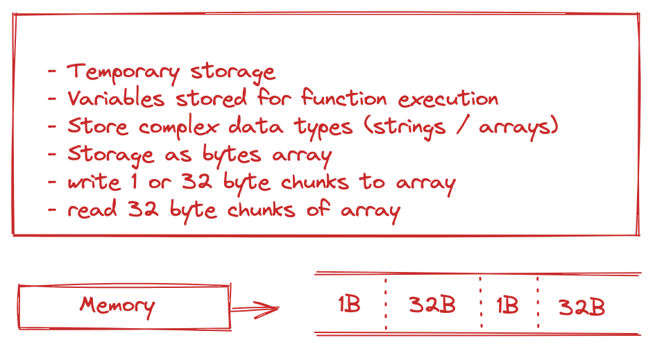

# ETHEREUM 104

## Summary

In this session, we dive into EVM architecture, various opcodes and their gas computations

[Video](https://www.youtube.com/watch?v=MFoxW07ICKs)

### Memory

- Data in memory is volatile, ie not persistent outside of functions where it is called
- Linear → byte array. Addressable at byte level
- It is Zero initialized
- 3 instructions that operate on memory → MSTORE (stores 32 bytes)/ MLOAD (loads 32 bytes)/ MSTORE8 (stores 1 byte)



### Storage

- Storage is non-volative, ie persistent
- Storage is a key-value, key is name, value is storage value. Its a 256 bit -> 256 bit mapping
- Zero initialized
- Storage of each account is captured in storage root which is implemented as a Merkle Patricia tree.
- State root is a hash of storage root along with other fields, balance, nonce and codeHash. And state root has its own implementation of merkle patricia tree -> its a root hash of all storage roots across all ethereum accounts
- There are 2 instructions - SLOAD - loads a word from storage to stack /SSTORE - stores a word from stack and puts it into storage

### Call data

- Special place where data parameters for transactions & msg calls can be stored
- Read only
- Byte addressable
- EVM has 3 instructions that operate with calldata
  - `CALLDATASIZE` gives size of supplied call data
  - `CALLDATALOAD` - Loads call data supplied to stack
  - `CALLDATACOPY` - Copies call data to specific region in memory

### EVM Architecture

- Computer architecture is classified either as Von Neumann vs Harvard architecture
- This is decided by how code and data is handled within architecture
- Are they stored together or are they transported in buses together or separately. Are they cached etc (memory and pathways)
- Incase of EVM, EVM code is stored separately in virtual ROM & special instructions to access EVM code

**EVM Ordering**

- Big-Endian vs Little Endian ordering
- Ethereum uses Big Endian - most significant byte is stored at lowest address and least significant byte is stored at largest address

- For example, if we have `0x12345678`, hex data that is 4 bytes long

```
    Little Endian
        78 56 34 12

    Note that in little endian, least significant byte `72` is stored before most significant byte `12`

    Big Endian
        12 34 56 78

    In the Big Endian, most significant byte `12` is stored before least significant byte. This is kind of more natural to visualize.


```

### instruction set

Eleven categories of instructions

|           Category            |
| :---------------------------: |
| Stop & Arithmetic Operations  |
|  Comparison & Bitwise Logic   |
|             SHA3              |
|   Environmental Information   |
|       Block Information       |
| Stack, Memory, Storage & Flow |
|             Push              |
|          Duplication          |
|             Swap              |
|            Logging            |
|            System             |

**Stop & Arithmetic Instructions**

| Hex Code |  Nuemonic  | # of Stack Items Placed | # of Stack Items Removed |             Description |
| -------- | :--------: | ----------------------: | -----------------------: | ----------------------: |
| 0x00     |    STOP    |                       0 |                        0 |          Stop operation |
| 0x01     |    ADD     |                       2 |                        1 |                Addition |
| 0x02     |    MUL     |                       2 |                        1 |          Multiplication |
| 0x03     |    SUB     |                       2 |                        1 |             Subtraction |
| 0x04     |    DIV     |                       2 |                        1 |                Division |
| 0x05     |    SDIV    |                       2 |                        1 | Signed Integer Division |
| 0x06     |    MOD     |                       2 |                        1 |                  Modulo |
| 0x07     |    SMOD    |                       2 |                        1 |           Signed Modulo |
| 0x08     |   ADDMOD   |                       3 |                        1 |              Add Modulo |
| 0x09     |   MULMOD   |                       3 |                        1 |         Multiply Modulo |
| 0x0a     |    EXP     |                       2 |                        1 |             Exponential |
| 0x0b     | SIGNEXTEND |                       2 |                        1 |             Sign Extend |

**Comparison & Bit-wise Logic**

| Hex Code | Nuemonic | # of Stack Items Placed | # of Stack Items Removed |                  Description |
| -------- | :------: | ----------------------: | -----------------------: | ---------------------------: |
| 0x10     |    LT    |                       2 |                        1 |                    Less Than |
| 0x11     |    GT    |                       2 |                        1 |                 Greater Than |
| 0x12     |   SLT    |                       2 |                        1 |               Sign Less Than |
| 0x13     |   SGT    |                       2 |                        1 |            Sign Greater Than |
| 0x14     |    EQ    |                       2 |                        1 |                     Equal to |
| 0x15     |  ISZERO  |                       1 |                        1 |                      Is Zero |
| 0x16     |   AND    |                       2 |                        1 |                  Bitwise AND |
| 0x17     |    OR    |                       2 |                        1 |                   Bitwise OR |
| 0x18     |   XOR    |                       2 |                        1 |                          XOR |
| 0x19     |   NOT    |                       1 |                        1 |                          NOT |
| 0x1a     |   BYTE   |                       2 |                        1 | BYTE (single byte from word) |
| 0x1b     |   SHL    |                       2 |                        1 |                   Shift Left |
| 0x1c     |   SHR    |                       2 |                        1 |                  Shift Right |
| 0x1d     |   SAR    |                       2 |                        1 |                 Signed Right |

**SHA3**

| Hex Code | Nuemonic | # of Stack Items Placed | # of Stack Items Removed |           Description |
| -------- | :------: | ----------------------: | -----------------------: | --------------------: |
| 0x20     |   SHA3   |                       2 |                        1 | SHA3 (Keccak256 hash) |

**Environmental Information**

| Hex Code |    Nuemonic    | # of Stack Items Placed | # of Stack Items Removed |                           Description |
| -------- | :------------: | ----------------------: | -----------------------: | ------------------------------------: |
| 0x30     |    ADDRESS     |                       0 |                        1 |                       Account Address |
| 0x31     |    BALANCE     |                       1 |                        1 |                       Account balance |
| 0x32     |     ORIGIN     |                       0 |                        1 |              Transaction origin (EOA) |
| 0x33     |     CALLER     |                       0 |                        1 |                            Msg sender |
| 0x34     |   CALLVALUE    |                       0 |                        1 |                             Msg value |
| 0x35     |  CALLDATALOAD  |                       1 |                        1 |               Loads calldata to stack |
| 0x36     |  CALLDATASIZE  |                       0 |                        1 |       Loads size of calldata to stack |
| 0x37     |  CALLDATACOPY  |                       3 |                        0 |               Copies call data to mem |
| 0x38     |    CODESIZE    |                       0 |                        0 |               Size of code in account |
| 0x39     |    CODECOPY    |                       3 |                        0 |                Copies the code to mem |
| 0x3a     |    GASPRICE    |                       0 |                        1 |      Gas price (transaction.gasPrice) |
| 0x3b     |  EXTCODESIZE   |                       1 |                        1 |           External contract code size |
| 0x3c     |  EXTCODECOPY   |                       4 |                        0 |           Copies external code to mem |
| 0x3d     | RETURNDATASIZE |                       0 |                        1 | Returns size of output from prev call |
| 0x3e     | RETURNDATACOPY |                       3 |                        0 |             Copies return data to mem |
| 0x3f     |  EXTCODEHASH   |                       1 |                        1 |             Copies external code hash |

**Transaction Block Information**

| Hex Code |  Nuemonic  | # of Stack Items Placed | # of Stack Items Removed |                                     Description |
| -------- | :--------: | ----------------------: | -----------------------: | ----------------------------------------------: |
| 0x40     | BLOCKHASH  |                       1 |                        1 | Block Hash of one of the 256 most recent blocks |
| 0x41     |  COINBASE  |                       0 |                        1 |       Beneficiary address for block reward Hash |
| 0x42     | TIMESTAMP  |                       0 |                        1 |                                Blocks Timestamp |
| 0x43     |   Number   |                       0 |                        1 |                                   Blocks Number |
| 0x44     | Difficulty |                       0 |                        1 |                               Blocks Difficulty |
| 0x45     | Gas Limit  |                       0 |                        1 |                                       Gas Limit |

_For BlockHash - if the block is not in latest 256 blocks, it returns 0_

**Stack, Memory, Storage and Flow**

| Hex Code | Nuemonic | # of Stack Items Placed | # of Stack Items Removed |                                                 Description |
| -------- | :------: | ----------------------: | -----------------------: | ----------------------------------------------------------: |
| 0x50     |   POP    |                       1 |                        0 |                                     Pops element from stack |
| 0x51     |  MLOAD   |                       1 |                        1 |                                Loads from memory (32 bytes) |
| 0x52     |  MSTORE  |                       2 |                        0 |                                 Stores to memory (32 bytes) |
| 0x53     | MSTORE8  |                       2 |                        0 |                                   Stores to memory (1 byte) |
| 0x54     |  SLOAD   |                       1 |                        1 |                                          Loads from storage |
| 0x55     |  SSTORE  |                       2 |                        0 |                                           Stores to storage |
| 0x56     |   JUMP   |                       1 |                        0 |                         Jumps to specific location in stack |
| 0x57     |  JUMPI   |                       2 |                        0 |                         Jumps to specific location in stack |
| 0x58     |    PC    |                       0 |                        1 |                                    Value of program counter |
| 0x59     |  MSIZE   |                       0 |                        1 |                              Size of active memory in bytes |
| 0x5a     |   GAS    |                       0 |                        1 |              Amount of available gas as of this instruction |
| 0x5b     | JUMPDEST |                       0 |                        0 | Particular destination is valid. No change to state as such |

**Push operation**

| Hex Code | Nuemonic | # of Stack Items Placed | # of Stack Items Removed |                 Description |
| -------- | :------: | ----------------------: | -----------------------: | --------------------------: |
| 0x60     |  PUSH1   |                       0 |                        1 |  Pushes 1 byte to the stack |
| 0x61     |  PUSH2   |                       0 |                        1 | Pushes 2 bytes to the stack |

PUSH3, PUSH4,....., PUSH32 instructions -> all the way to pushing 32 bytes onto stack

**Duplication operation**

| Hex Code | Nuemonic | # of Stack Items Placed | # of Stack Items Removed |                 Description |
| -------- | :------: | ----------------------: | -----------------------: | --------------------------: |
| 0x80     |   DUP1   |                       1 |                        2 | Duplicates first stack item |

DUP2, DUP3,...., DUP16 -> duplicates all the way till 16'th element in stack

**Exchange operation**

| Hex Code | Nuemonic | # of Stack Items Placed | # of Stack Items Removed |                          Description |
| -------- | :------: | ----------------------: | -----------------------: | -----------------------------------: |
| 0x90     |  SWAP1   |                       2 |                        2 | Swaps first and second item on stack |
| 0x91     |  SWAP2   |                       2 |                        2 |  Swaps first and third item on stack |

SWAP3, SWAP4,...., SWAP16 -> swaps the top element all the way till the 17'th element

**Logging operation**
| Hex Code | Nuemonic | # of Stack Items Placed | # of Stack Items Removed | Description |
| -------- | :------: | ----------------------: | -----------------------: | -----------------------------------: |
| 0xa0 | LOG0 | 2 | 0 | Logs the event and first topic |
| 0xa1 | LOG1 | 3 | 0 | Logs the event and second topic |

LOG0, LOG1.. LOG4 - number of topics that are specified by the log

- Indexed parameters in the log go into topics
- Non-indexed parameters in the log go into `data`
- Indexed parameters are much faster to search - that's the main purpose of indexing

**System Operations**

| Hex Code |   Nuemonic   | # of Stack Items Placed | # of Stack Items Removed |                                                                                                              Description |
| -------- | :----------: | ----------------------: | -----------------------: | -----------------------------------------------------------------------------------------------------------------------: |
| 0xf0     |    CREATE    |                       3 |                        1 |                                                            Create a new contract account that has storage and code in it |
| 0xf1     |     CALL     |                       7 |                        1 |                                                   Allows the current executing context to do a msg call to other account |
| 0xf2     |   CALLCODE   |                       7 |                        1 |             Lets caller account call a callee account & let callee account execute function with state of caller account |
| 0xf3     |    RETURN    |                       2 |                        0 |                                                                                              Halts execution and returns |
| 0xf4     | DELEGATECALL |                       6 |                        1 |                                                Similar to CallCode. msg.value and msg.sender in DELEGATECALL caller data |
| 0xf5     |   CREATE2    |                       4 |                        1 |                             Used to create new accounts with code/storage, with a predictable address for those accounts |
| 0xfa     |  STATICCALL  |                       6 |                        1 |                             Allows callee account to read state of caller account without modifying caller account state |
| 0xfd     |    REVERT    |                       2 |                        0 |                                                                     Reverts execution of transaction. Returns unused gas |
| 0xfe     |   INVALID    |                       0 |                        0 |                                                               Uses all gas supplied to it. used in static analysis tools |
| 0xfe     | SELFDESTRUCT |                       1 |                        0 | Halts execution but also destructs account of executing context. Sends all ether in executing context to another address |

- `CREATE` can be used by EOAs or other contracts
- Address of newly created account depends on address of sender and nonce of that account - so we can predict the creation address in advance
- `CALL` allows caller account to do a msg call to a callee account - so one contract can talk to another
- Difference between `DELEGATECALL` and `CALLCODE` is, incase of `DELEGATECALL`, the msg.sender and msg.value is that of the caller and no the callee

**Gas Costs of Instructions**

- Different instructions have different gas costs -> based on complexity and storage needed for executing those instructions

| Operation              | Gas Cost |
| ---------------------- | :------: |
| STOP/INVALID/REVERT    |    0     |
| ARITHMETIC/LOGIC/STACK |   3-5    |
| MLOAD/MSTORE/MSTORE8   |    3     |
| CALL/BALANCE/EXT\*     |   2600   |
| SLOAD                  |   2100   |
| SSTORE                 |  20000   |
| CREATE                 |  32000   |
| SELFDESTRUCT           |   6000   |

- `CREATE` is one of the most gas guzzling instruction

**Transaction Revert**

- Transaction can revert for different conditions
  - Run out of gas
  - Invalid instructions
- **All State Changes are discarded if transaction reverts**
- Original state before transaction was executed gets restored - as if tx never executed

**Transaction Data**

- Important when recepient is a contract account
- Tx data contains `function` and `arguments` if any
- Function and arguments have to be encoded
- This is encoded as per ABI (Application Binary Interface)
