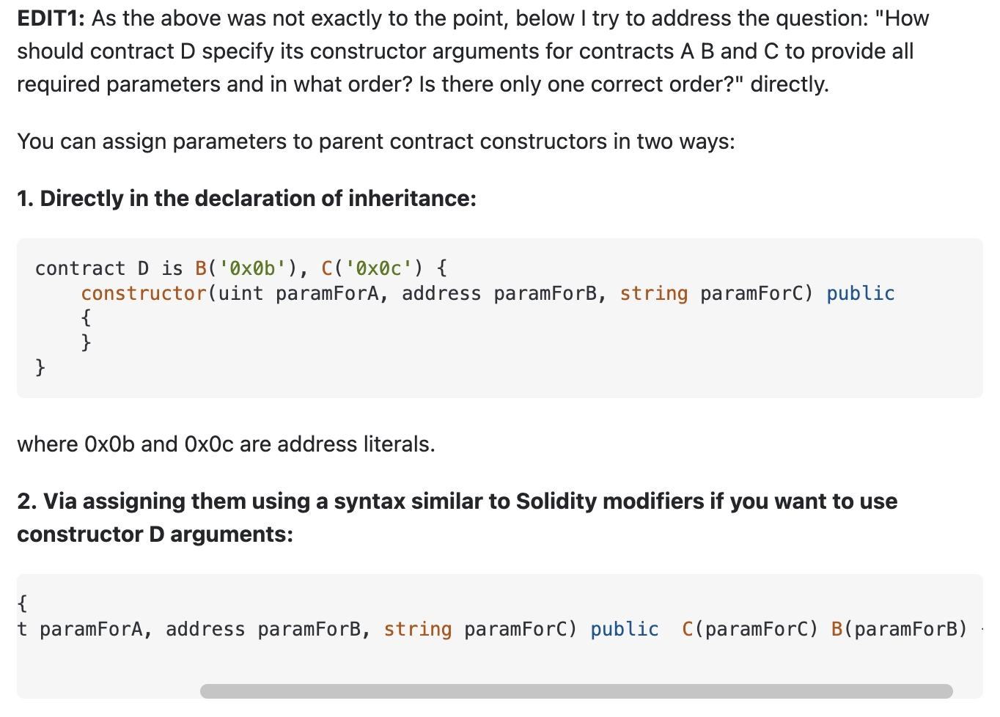

# SOLIDITY 201

[Video](https://www.youtube.com/watch?v=3bFgsmsQXrE)

## Summary

Discuss inheritance, abstract functions, virtual & override keywords and other OOP concepts

### Inheritance

- Solidity supports multiple inheritance and polymorphism
- polymorphism means function call executes function with specified name and parameters in the most derived contract in the inheritance hierarchy
- When contract is derived from multiple contracts -> only single contract is created on blockchain. Code from all base contracts is combined into created contract
- Solidity supports function overriding - base class functions can be overriden
- `virtual` keyword is used for functions that can be overriden in derived contracts
- `override` keyword is used for functions that are overriding virtual functions
- when multiple inheritance, language has to solve for what is called `diamond` problem
- uses the same technique as in python called `c3 linearization` - Refer to article 6 in [resources](./00-resources.md)
- To summarize, bases are ordered from right to left -> and constructors() are called in that specific order
- When a function called is defined in multiple classes, given bases are searched right to left in a depth first manner & stopping at first match

### Contract types

- Solidity supports 3 other contract types

  - abstract contracts
  - interfaces
  - library

- `abstract` contracts are where atleast one of functions is not implemented. As a result, they cannot be compiled.

  - used as a base contracts from which new contracts can be derived
  - use `abstract` keyword
  - Generally an abstract contract contains both implemented as well as abstract functions.
  - Derived contract will implement the abstract function and use the existing functions as and when required.

- `interface` contracts cannot have any of the functions implemented and all functions are external

  - cannot inherit from other contracts
  - cannot have constructors
  - cannot have state variables
  - specified using `interface` keyword

- `library` deployed once, can be used by any contract
- callers call library functions using `delegatecall` - state is of the caller contract but logic of library functions is in `library` contract
- specified using `library` keyword

**Using For**

- `using A for B` - we can attach library functions to specific types. A is library, B is specific type
- If contract A has `foo(B input)` implemented, you can call library functions by doing `B.foo()` -> as if its a member of the same contract
- This directive is only valid in current contract and does not apply outside of the contract
- eg. `using SafeMath for uint256` -> variables of uint256 can attach functions in SafeMath -> only applies for the current contract

**Inheritance hierarchy**

- Can call a function from base class
  - if immediate higher up (one level up), use `super.function()`
  - if from a specific contract, say A, use `A.function()`

**Shadowing**

- Until 0.6.0, shadowing of variables was allowed
- Derived contracts could use state variables of same name as their base class
- Removed hence as it was creating confusion and could create serious security issues
- Shadowing is removed - state variables in derived classes can ONLY be declared if state variables of same name don't exist in base classes

**Overriding changes**

- `virtual` functions in base class can be overriden by using `override` keyword in derived classes
- visibility of virtual functions can be changed from external to public by `overriding` them
- mutability of functiosn can be changed but only from `non payable` functions to `view/pure` or `view` functions can be changed to `pure`
- `payable` mutability is an exception and CANNOT be changed to any other mutability type

**Virtual functions**

- functions without ones without implementation
- Have to be marked `virtual` outside of intefaces
- All functions inside `interfaces` are automatically considered virtual. Not needed to define as virtual
- functions with `private` visibility CANNOT be made virtual
- If a contract is of `abstract` type, a function can be made virtual only by defining `virtual` keyword

**State variables and override**

- Public state variables have automatic getter functions generated by solidity complier
- these getters are `view` type functions that give us value of public state variables
- Public functions **override** any external functions defined with same name and having same parameter and return types (public functions are automatic getter functions generated by compiler and they take precedence - make sure you avoid function clashes)

- While Public state variable getter functions override external functions, override functions CANNOT override Getter functions

**Function modifiers and overrides**

- Modifier overriding is also possible
- Works very similar to function overriding
  - `virtual` must be used for overriden modifiers
  - `override` must be used for overriding modifiers
- Overloading for modifiers is NOT allowed (allowed for functions though)

**Base constructor**

- Constructors will be called following linearization rules (C3 rules, right to left for solidity)
- If base constructor has arguments, derived contracts MUST specify those arguments -> can be done in Derived constructor itself or by providing inheritance list
  (See this [stack overflow article](https://ethereum.stackexchange.com/questions/48951/providing-base-contracts-constructor-arguments) for more on this)

**Name Collision**

Name collision is an error if any of following pairs have same name in base and derived classes:

- Function & Modifier
- Function & Event
- Event & Modifier

**Library Restrictions**

- Cannot have state variables
- Cannot inherit from other contracts
- Cannot receive ether
- Cannot be destroyed
- Have access to state variables of calling contract ONLY if explicitly supplied (ie as function arguments) - this is because library functions are `pure` implementations that cannot access the account data
- Library functions can be used directly WITHOUT delegatecall if they do not modify the state( that is if they are pure and view functions)

[Changing State using Library Functions](https://ethereum.stackexchange.com/questions/92497/how-can-library-change-state#:~:text=A%20library%20can%20be%20used,a%20class%20with%20static%20methods.)

- A library can change the state of a calling contract through a delegatecall. In this case, the function is executed as though it were written directly in the calling contract.
- This means it can in theory modify any part of the calling contract's state, so long the corresponding variables have been declared in the library, (but not initialized, since the library has no state of its own).
- If you try to call such a function directly, it will fail, as it is not intended to change/modify its own storage (because no such storage exists), rather, the corresponding storage on a calling contract.

---

### EVM Storage

- Storage is key/value store -> 256 bit words -> 256 bit words mapping
- Instructions used to access storage are `SLOAD` && `SSTORE`
- All storage locations are initialized to zero

- State variables are stored in EVM storage using storage slots
- Each slot in EVM storage corresponds to word size of 256 bits -> and various state variables names declared in smart contracts map to these storage slots
- If multiple variables can fit into same storage slot, they are done so in a compact manner within same slot
- Mapping is done in same order as they are declared -> so if var A is declared before var B -> A is stored in storage slot before slot for B -> First variable stored in slot 0, second in slot 1 and so on.. (can be slot 0 if the size of var A + var B < 256 bits)
- Except for dynamic arrays and mappings, all state variables are stored contiguously in EVM storage (item after item, starting with first state variable)

**Storage Packing**

- Multiple State variables can be packed in same storage slot if the size of these variables permits so - this leads to compact packing of data within these slots
- Contiguous & fit < 32 bytes -> same storage slot
- Contiguous & > 32 bytes -> variable stored in next storage slot
- Value types have exact size -> so easy to pack them in contuguous fashion
- State variables of type `struct` and `arrays` are packed into a new storage slot as opposed to fitting in existing one
- State variables following these above types ALSO start a new storage slot (so even if its a value type, if it follows a struct/array, variable will start a new storage slot)
- Elements in a struct or array are packed contiguously and individual values in these elements follow same rules as above (as if they are individual values)

**Inheritance and storage layout**

- Order of state variables of inherited contracts is determined by C3 linearization rule
- State variables storage moves from most base to most derived
- And it is possible that state variables from derived contracts CAN share same storage as base contracts (or other derived contracts) - subject to packing rules
- Storage packing allows us to optimize storage layout based on types of storage variables
- If we club reduced size types, we can pack multiple storage variables in same slot
- Allows solidity compiler to combine multiple reads/writes into a single operation & hence reduce gas
- However if values in slot are not read or written at same time, then it has opposite effect - because solidity reads/writes entire slot at one time & it has to do additional operations to isolate the state variable we want -> this is done by masking all other variables in that slot -> and this could get expensive if slot is compactly packed -> so depending on how we call, this could become more or less efficient

**Ordering**

- Ordering of state variables impact of layout of storage slots
- Multiple variables can be packed into same storage slot
- This packing has huge impact on gas costs for SLOAD && SSTORE -> some of the most expensive instructions

For eg if 3 variables, uin128, uint128 and uint256 are declared -> we have 2 storage slots,
2 variables in first slot, and one in the next

If declaration is uint128, uint256, uint128 -> 3 storage slots would be used instead of 2
