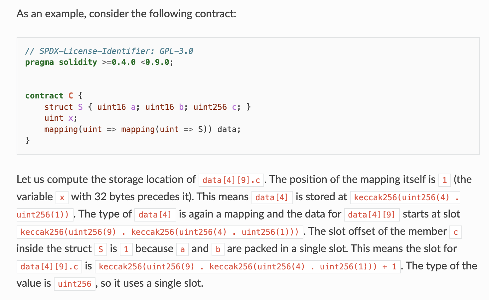

# SOLIDITY 202

[Video](https://www.youtube.com/watch?v=TqMIbouwePE)

## Summary

Discuss mapping & dynamic array storage slots

## EVM Storage

**Mapping & Dynamic Arrays**

- These types are not as simple as value types
- These types are unpredictable interms of their size
- Storage slots allocated for these types cannot be reserved inbetween slots of state variables that surround them
- Storage slot for these types is 32 bytes but the elements within these types are stored elsewhere
- Starting element of storage slot is computed using `keccak256` hash

_How this works for dynamic arrays_

- Lets say a dynamic array A is stored in a 32 byte store slot `p`
- Now slot `p` contains the length of the array
- Actual elements are stored in a different location whose element starts with `keccak256(p)` -> keccak256 hash of the slot number `p`
- Elements within the array are stored contiguously and may share same slots if possible
- And if there is a dynamic array within dynamic array -> this logic is used recursively for all child arrays

_How this works for mappings_

- For mappings layout rules are different from arrays
- Mapping type stores in a 32 byte slot `p`
- Unlike dynamic array that stores array size, this slot holds **nothing** (blank slot)
- `mapping[key k]` -> stores in storage slot element `keccak256(h(k).p)` where
  - `.` represents concatenation
  - `h` -> type specific function -> for value types -> padded upfront to make 32 bytes
    -> for string/byte, keccack256() of unpadded data

Here is an example in Solidity Documentation

**Bytes & String**

- Storage layout is similar to that of arrays
- Storage slot `p` stores the length of string/byte
- elements of the variable are stored in `keccak256(p)`
- Interesting optimization
  - if values < 32 bytes, elements along with length is stored in same slot
  - In this case, elements are stored in higher order bytes (left aligned ) and lowest order bytes store the value length \* 2
  - for byte arrays that store data which is >32 or more bytes, main slot stores length \* 2 + 1 and data is stored in keccak256(p)
  - **This means that you can distinguish a short array from a long array by checking if the lowest bit is set to 0 or 1: short (not set, 0) and long (set, 1).**

---

## EVM Memory

- EVM memory is a linear layout
- All memory locations are stored linearly -> next to each other
- Memory locations can be addressed at byte level
- `MLOAD/MSTORE/MSTORE8` are used to load and store data to memory
- All locations are zero initialized
- Solidity allocates new memory objects at free pointer
- Memory is never freed
- Free memoery pointer is assigned to `0x80`
- Memory layout matters when developer is manipulating memory at the assembly level - otherwise, we can leave it to the compiler to take care

**Reserved Memory**

- Solidity reserves 4 32 byte slots - 128 bytes
- `0x00`-`0x3f` (64 bytes) -> scratch space for hashing methods
- `0x40`-`0x5f` (32 bytes) -> currently allocated memory size (free memory pointer)
- `0x60`-`0x7f` (32 bytes) -> zero slot -> should never be written -> initial value for dynamic memory arrays
- Scratch space can be used between statements (i.e. within inline assembly).
- For memory arrays, every element in the array occupies 32 bytes (even if element is not of 32 bytes, still 32 bytes of memory is allocated) - this is not true for bytes and string types
  -Dynamic array -> length of array is stored in first slot, followed by elements

- Free Memory Pointer - position of the memory slot is `0x40`. Initial value in the free memory pointer is 0x80 - just beyond reserved slots
- This free memory pointer points to free memory that is allocatable at any point in time
- When memory is allocated, free memory pointer gets updated
- With respect to memory containing 0 bytes (zeroed memory), there is no guaranteees made by solidity compiler that memory allocated has not been used before. Once cannot assume that memory contents contain 0 bytes
- Reason for this is there is no built in mechanism to free or release memory
- This again becomes a security issue if one is manipulating memory at assembly level - if one is using memory - need not necessarily assume that location has zero bytes - any logic that assumes this might have a vulnerability

**Reserved Keywords**

- Reserved for future use - should not be using these keywords as variable names
- Current syntax - not used but can change in future
- Some eg. `after, alias, apply, auto, case, null etc.`

**Inline Assembly**

- Access EVM features directly at a low level -. skip all the solidity syntax and access at opcode level
- Developer working at assembly level bypasses security features of compiler (eg. Type safety) - this has significant security implications
- Language used for inline assembly is called `Yul`
- Inline assembly block is marked by using `assembly{...}` -> anything inside the block is treated as low level code to interact with EVM

**Assembly access**

- Yul supports assembly access to external variables, functions & libraries
- Local variables of value type are not stored as value but as a pointer reference
- Local variables are cheaper gas wise than memory or call data
- For storage variables, state variables allocated in storage, single yul identifier is not sufficient -> we need to specify `slot` and `offset` within slot. This is because, 2 variables
  can be packed in same storage & hence has same `slot` -> in such cases, I will need the offset varable as well

  **Yul Syntax**

  - Yul supports literals and calls
  - variable declarations, assignments are possible
  - scoping blocks are supported ??
  - switch control - if /switch/for
  - function definitions are supported
  - From a security perspective, this is very critical -> coding in Yul might result in serious bugs

---
